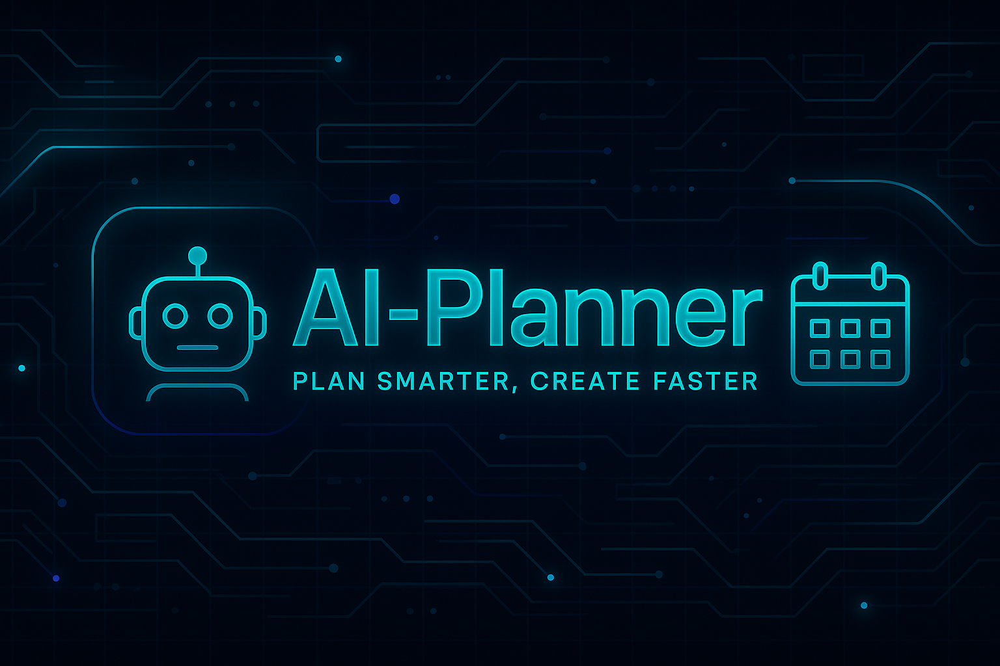
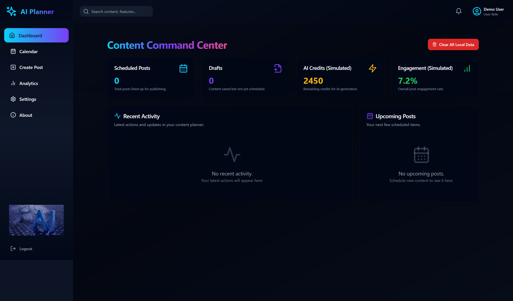

<h1 align="center">
  🚀 AI-Planner Dashboard
</h1>
 

<p align="center">
  
</p>

<p align="center">
  <b>Reimagine planning with AI. Auto-generate content, organize with style, and manage everything in one beautiful, animated dashboard.</b><br>
  <i>Crafted for the future. Built for creators.BANNER2.png</i>
</p>

---

## ✨ Overview

The **AI-Planner Dashboard** is a futuristic content management platform that merges AI automation with smooth animations and a user-first design. It simulates a SaaS product that helps users streamline their social media strategy and personal planning using **cutting-edge UI, real-time interactions, and simulated OpenAI capabilities**.

---


## 📸 Screenshots

<!-- Replace with your own screenshots -->
| Dashboard |
|-----------|
|  |

## ⚡ Key Features (with Motion)

🎯 **AI Content Generation**  
> Generate smart captions & ideas using a simulated OpenAI API.

📅 **Dynamic Content Calendar**  
> Drag-n-drop posts in an interactive, animated calendar dashboard.

🎨 **Framer Motion UI**  
> Fluid transitions, button morphing, and hover effects for seamless user experience.

📊 **Analytics Dashboard**  
> View post impressions, likes, engagement, and trend graphs (mock data).

📤 **Save Drafts & Schedule**  
> Store, manage, edit or publish content with animated transitions.

👤 **User Profile + Settings Panel**  
> Animated sidebar for user preferences, alerts, and notification management.

---

## 🧠 About The Project

A personal project by [**Aman Pushp**](https://github.com/AMANPUSHP23), showcasing full-stack capabilities using **React, Tailwind, Framer Motion, and Vite**. It represents modern, AI-enabled design thinking with a focus on scalability, UI excellence, and real-world use simulation.

---

## 🛠️ Tech Stack

| Stack            | Description                                               |
|------------------|-----------------------------------------------------------|
| ⚛️ React 18       | Component-based UI architecture                           |
| ⚡ Vite           | Lightning-fast build system                              |
| 🌈 Tailwind CSS   | Utility-first styling with responsive design             |
| 💫 shadcn/ui      | Pre-styled UI component library                          |
| 🌀 Framer Motion  | Animation for React (entry/exit, transitions, gestures) |
| 🧩 React Router 6 | Page navigation                                          |
| 🧠 Simulated OpenAI | For AI-powered content (mock implementation)            |
| ☁️ Supabase (for prod) | Cloud backend simulation                            |
| 🗄️ LocalStorage    | Temporary user/session data                             |
| 📎 Lucide Icons    | Clean, lightweight icon system                          |

---

## 🚀 Getting Started

### 1. Clone this futuristic repo

```bash
git clone https://github.com/AMANPUSHP23/AI-planner.git
cd AI-planner
--------------------------------------------
 Install dependencies
 -------------------------------------------
 npm install
--------------------------------------------
Launch your AI planner
--------------------------------------------
npm run dev
🌐 Navigate to: http://localhost:3000

🎬 Demo Preview
🟢 Live 

<p align="center"> [Check Live App](https://ai-planner-app.netlify.app/auth)  </p>

🧑‍🚀 The Developer
Aman Pushp – Full-Stack React Developer

“Code is poetry. I create beautiful, scalable, and smart interfaces that feel alive.”

🔗 GitHub
🔗 LinkedIn
💡 Open for collaborations and SaaS projects

🤝 Contributions
You’re welcome to join the mission!
🚀 Fork → Branch → Code → PR → Let's build the future.


📜 License
© 2025 Aman Pushp
This repository is for educational & demo purposes only.

“Design the future with AI. Plan smarter. Create faster. Execute beautifully.”
— AI-Planner


